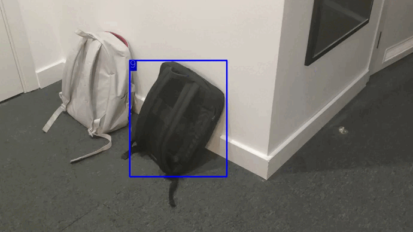

# MDETR_SORT_object_tracker

<div align="center">
<p>
 

</p>
<p>
 
 
</p>
<br>
<div>
<a href="https://colab.research.google.com/drive/1r7-x6c2cfobrmpB986j0CQPzNOomdWoW?usp=sharing"></a>
 
</div>

</div>


## Introduction

This repository contains an easily configurable tracker based on the MDETR detector. The SORT method was used as a tracking algorithm

## Before running the tracker

1. Clone repository recursively: `git clone --recurse-submodules https://github.com/trofik00777/MDETR_SORT_object_tracker`. If you already cloned and forgot to use `--recurse-submodules` you can run `git submodule update --init`
2. Make sure that you fulfill all the requirements: `pip install -r requirements.txt`

## Usage

You can see how to work with the tracker in [google colab](https://colab.research.google.com/drive/1r7-x6c2cfobrmpB986j0CQPzNOomdWoW?usp=sharing) or view the `MDETR_SORT.ipynb` file.

Using Tracker in your project:

```python
from tracking import track

my_file_path = "./myvideo.mp4"
my_out_path = "./myout.mp4"

i_want_to_track = "person"
is_logging = True  # Generate log.txt in MOT challenge format
max_age = 5  # How many frames can an object be missing before it is destroyed
min_htis = 4  # How many frames do I need for the object to start to track
iou = 0.3

track(my_file_path, my_out_path, i_want_to_track, max_age=max_age, min_htis=min_htis, iou_threshold=iou, log=is_logging)

```

